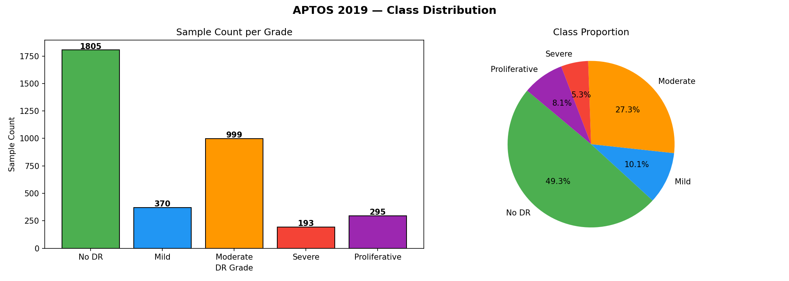
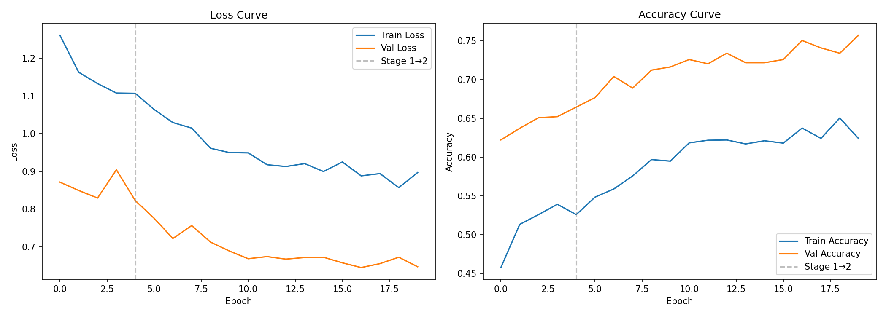
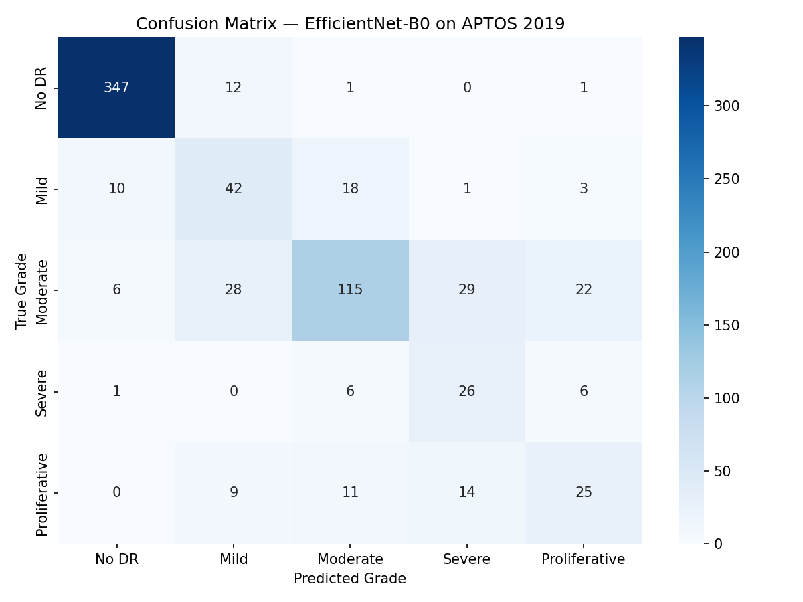
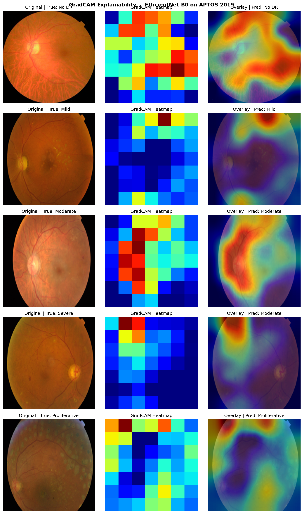

# Diabetic Retinopathy Grading with EfficientNet-B0

> Reproduction of Anand et al. (2024) — *Smart Grading of Diabetic Retinopathy: An Intelligent Recommendation-Based Fine-Tuned EfficientNetB0 Framework*  
> Frontiers in Artificial Intelligence, Vol. 7, 2024.

**Authors:** Eman Ali (23i-2564) · Fatima Siddiqa (23i-2543) · Mariam Shaiq (23i-3250)  
**Dataset:** [APTOS 2019 Blindness Detection](https://www.kaggle.com/c/aptos2019-blindness-detection) — 3,662 retinal fundus images  
**Framework:** PyTorch · Google Colab (NVIDIA T4 GPU)

---

## Results

| Metric | Paper (Anand et al.) | Ours |
|---|---|---|
| Accuracy | 0.91 | **0.7572** |
| AUC (Macro OvR) | 0.9949 | **0.9138** |
| Precision (Macro) | N/R | 0.5973 |
| Recall (Macro) | N/R | 0.6388 |
| F1-Score (Macro) | N/R | 0.6059 |

> Differences are attributed to dataset size (3,662 vs 3,200 images) and hardware constraints. See report for full discussion.

---

## Model Architecture

```
EfficientNet-B0 (ImageNet pretrained)
        ↓
  Dropout (p=0.4)
        ↓
  FC (1280 → 512)
        ↓
     ReLU
        ↓
  Dropout (p=0.3)
        ↓
  FC (512 → 5)
        ↓
  DR Grade (0–4)
```

---

## Training Strategy

Two-stage transfer learning following Anand et al. (2024):

- **Stage 1** — Head-only training for 5 epochs (lr=1e-3, backbone frozen)
- **Stage 2** — Full fine-tuning for up to 15 epochs (lr=1e-5, cosine annealing, early stopping patience=5)

Class imbalance handled via `WeightedRandomSampler`.

---

## Repository Structure

```
diabetic-retinopathy-grading-efficientnet/
│
├── DR_Grading_EfficientNetB0_APTOS2019.ipynb   # Main notebook (run this)
├── Diabetic Retinopathy Grading EfficientNet Reproduction Report.pdf # Report
├── README.md                          # This file
├── requirements.txt                   # Python dependencies
│
└── outputs/                           # Generated after running notebook
    ├── class_distribution.png
    ├── sample_grid.png
    ├── training_curves.png
    ├── confusion_matrix.png
    ├── results_comparison.csv
    ├── gradcam_visualisations.png
    └── best_model.pth
```

---

## Setup & Run

### 1. Clone the repo
```bash
git clone https://github.com/YOUR_USERNAME/diabetic-retinopathy-grading-efficientnet.git
```

### 2. Get the dataset
Download [APTOS 2019](https://www.kaggle.com/c/aptos2019-blindness-detection) from Kaggle and place files as:
```
train.csv
test.csv
train_images/   ← extracted from train.zip
test_images/    ← extracted from test.zip
```

### 3. Open in Google Colab
Upload `APTOS2019_Reproduction_v2.ipynb` to Colab, set runtime to **T4 GPU**, and run all cells top to bottom.

### 4. Update paths in Section 3
```python
class Config:
    DATA_DIR   = "/content/aptos2019"      # path to your dataset
    OUTPUT_DIR = "/content/drive/MyDrive/aptos_outputs"
```

---

## Requirements

```
torch
torchvision
scikit-learn
seaborn
matplotlib
pandas
Pillow
```

Install via:
```bash
pip install torch torchvision scikit-learn seaborn matplotlib pandas Pillow
```

---

## Sample Outputs

| Class Distribution | Training Curves |
|---|---|
|  |  |

| Confusion Matrix | GradCAM |
|---|---|
|  |  |

> Upload your output images to the `outputs/` folder in the repo for these to display.

---

## DR Severity Grades

| Grade | Severity | Samples |
|---|---|---|
| 0 | No DR | 1805 (49.3%) |
| 1 | Mild | 370 (10.1%) |
| 2 | Moderate | 999 (27.3%) |
| 3 | Severe | 193 (5.3%) |
| 4 | Proliferative | 295 (8.1%) |

---

## Reference

```
Anand, R., et al. (2024). Smart Grading of Diabetic Retinopathy: An Intelligent 
Recommendation-Based Fine-Tuned EfficientNetB0 Framework. 
Frontiers in Artificial Intelligence, 7.
```

---

## License

This project is for academic reproduction purposes only.
